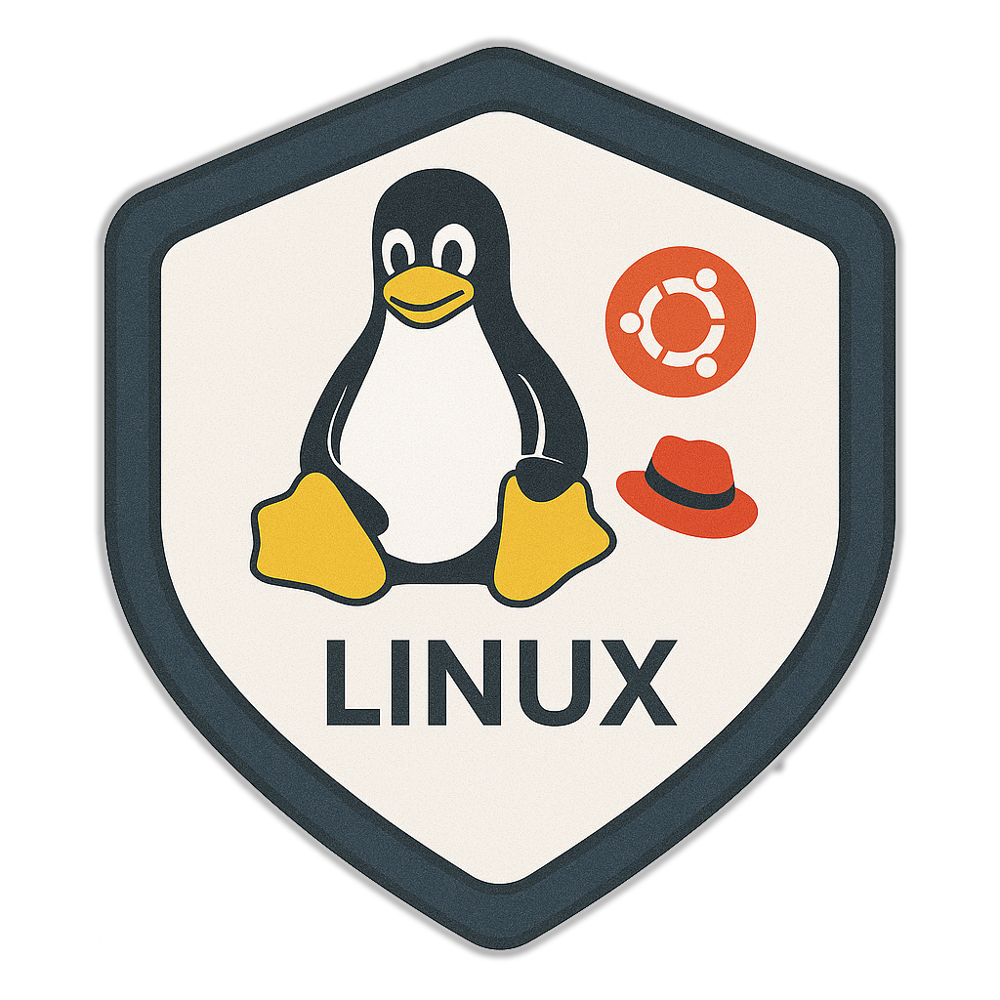
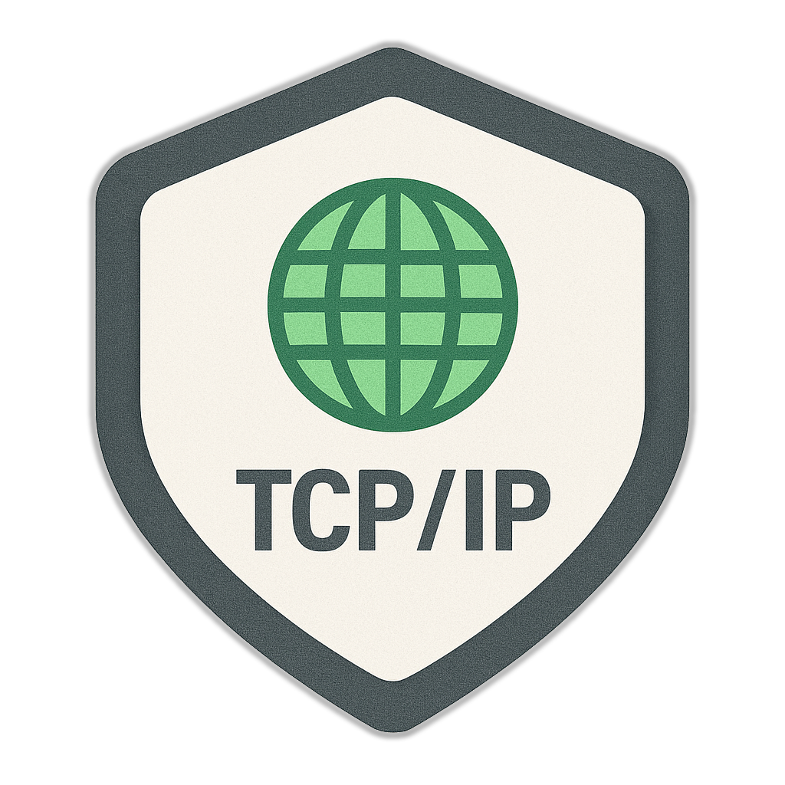
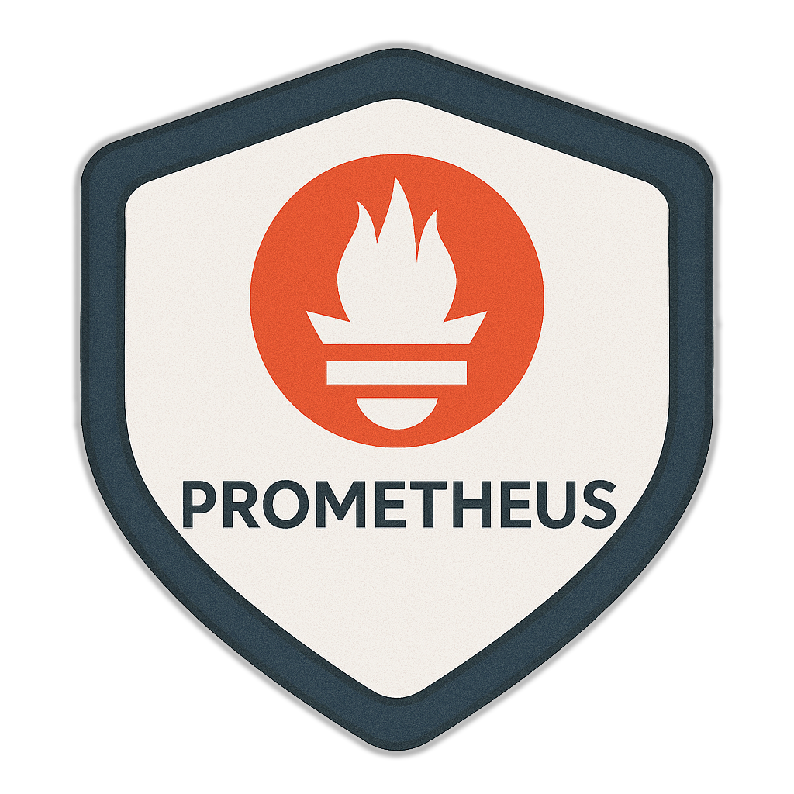

## About Me

An engineer with a fintech operations background, focused on system reliability, process automation, and lean backend development. I work at the edge of DevOps and support, delivering both business impact and technical depth. Most of what I know is self-taught or earned through actual production incidents.

---

## Certifications

<table align="center">
  <tr>
    <td></td>
    <td></td>
  </tr>
</table>

---

## Key Skills

<table align="center">
  <tr>
    <td></td>
    <td></td>
    <td></td>
    <td></td>
    <td></td>
  </tr>
  <tr>
    <td></td>
    <td></td>
    <td></td>
    <td></td>
    <td></td>
  </tr>
  <tr>
    <td></td>
    <td></td>
    <td></td>
    <td></td>
    <td></td>
  </tr>
  <tr>
    <td></td>
    <td></td>
    <td></td>
    <td></td>
    <td></td>
  </tr>
  <tr>
    <td></td>
    <td></td>
    <td></td>
    <td></td>
    <td></td>
  </tr>
</table>

---

## Projects

- **Syspectrum** – Lightweight monitoring stack: Node.js agent + Flutter dashboard + NeDB backend  
- **Custom Monitoring Platform** – Power Automate + MS Lists + Telegram bot for real-time infra alerts  
- **ENR Digitalization** – Backend & ops for 1,500+ Egyptian National Railway stations  
- **Metro Subscriptions System** – Designed and maintained scalable backend infra  
- **M-Pesa Operational Support** – Active monitoring tooling and operations  

---

## Contact

- 📧 loayghreep1@gmail.com  
- 🔗 [LinkedIn](https://www.linkedin.com/in/loay-ghreep-379580112/)

Available for freelance, contract, or full-time work—local or remote.
